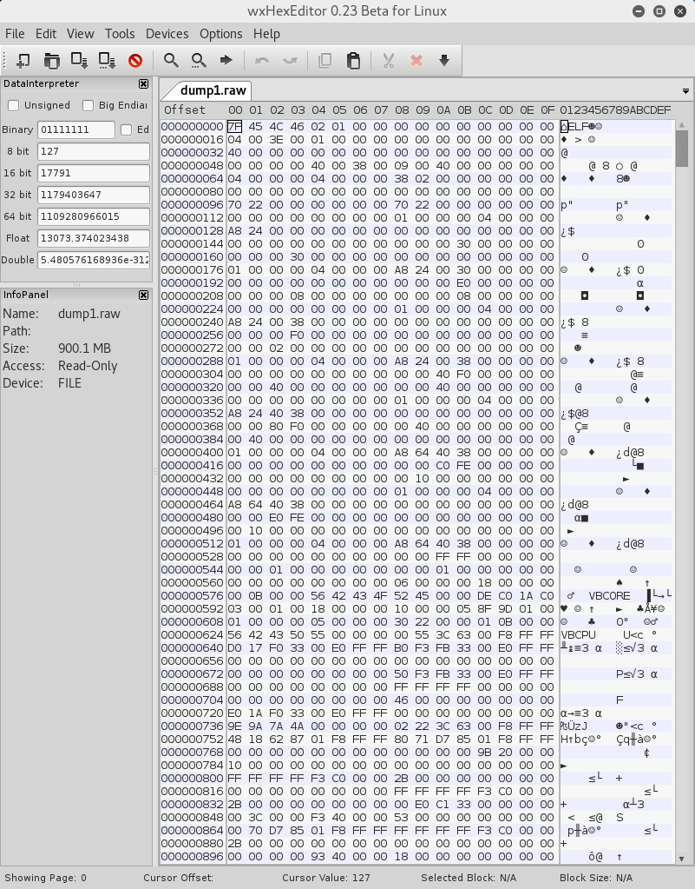

# Identify Provided Materials
Examination of the `dump1.raw` file revealed that the file is an ELF executable containing the magic codes `VBCORE` and `VBCPU`. Clearly, this is a system dump of a VirtualBox instance.



# Dump the Memory
```bash
$ objdump -h dump1.raw | egrep -w "(Idx|load1)"
Idx Name          Size      VMA               LMA               File off  Algn
  1 load1         30000000  0000000000000000  0000000000000000  000024a8  2**0
$ size=0x30000000; off=0x24a8; head -c $(($off+$size)) dump1.raw | tail -c +$(($off+1)) > mem.dmp
```

# Display Running Processes
Runnings `strings` on `mem.dmp` showed a number of unmistakeable Windows artifacts, such as `explorer.exe`, but we as yet had no idea which Windows version was running. We tried our luck running Volatility on it with all installed profiles:
```bash
for p in `volatility --info | grep "A Profile" | cut -d' ' -f1`; do
  echo $p; volatility -f mem.raw --profile=$p pslist;
done
```

It turned out to be a 64-bit Windows 10, with the following process list:
```
Offset(V)          Name                    PID   PPID   Thds     Hnds   Sess  Wow64 Start                          Exit                          
------------------ -------------------- ------ ------ ------ -------- ------ ------ ------------------------------ ------------------------------
0xffffe00032553780 System                    4      0    126        0 ------      0 2016-04-04 16:12:33 UTC+0000                                 
0xffffe0003389c040 smss.exe                268      4      2        0 ------      0 2016-04-04 16:12:33 UTC+0000                                 
0xffffe0003381b080 csrss.exe               344    336      8        0      0      0 2016-04-04 16:12:33 UTC+0000                                 
0xffffe000325ba080 wininit.exe             404    336      1        0      0      0 2016-04-04 16:12:34 UTC+0000                                 
0xffffe000325c7080 csrss.exe               412    396      9        0      1      0 2016-04-04 16:12:34 UTC+0000                                 
0xffffe00033ec6080 winlogon.exe            460    396      2        0      1      0 2016-04-04 16:12:34 UTC+0000                                 
0xffffe00033efb440 services.exe            484    404      3        0      0      0 2016-04-04 16:12:34 UTC+0000                                 
0xffffe00033f08080 lsass.exe               492    404      6        0      0      0 2016-04-04 16:12:34 UTC+0000                                 
0xffffe00033ec5780 svchost.exe             580    484     16        0      0      0 2016-04-04 16:12:34 UTC+0000                                 
0xffffe00034202280 svchost.exe             612    484      9        0      0      0 2016-04-04 16:12:34 UTC+0000                                 
0xffffe000341cb640 dwm.exe                 712    460      8        0      1      0 2016-04-04 16:12:34 UTC+0000                                 
0xffffe00034222780 svchost.exe             796    484     45        0      0      0 2016-04-04 16:12:34 UTC+0000                                 
0xffffe000342a7780 VBoxService.ex          828    484     10        0      0      0 2016-04-04 16:12:34 UTC+0000                                 
0xffffe000342ad780 svchost.exe             844    484      8        0      0      0 2016-04-04 16:12:34 UTC+0000                                 
0xffffe000342c0080 svchost.exe             852    484      6        0      0      0 2016-04-04 16:12:34 UTC+0000                                 
0xffffe000342dd780 svchost.exe             892    484     18        0      0      0 2016-04-04 16:12:34 UTC+0000                                 
0xffffe000342bc780 svchost.exe             980    484     17        0      0      0 2016-04-04 16:12:34 UTC+0000                                 
0xffffe00034377780 svchost.exe             608    484     17        0      0      0 2016-04-04 16:12:34 UTC+0000                                 
0xffffe000343e7780 spoolsv.exe            1072    484      8        0      0      0 2016-04-04 16:12:34 UTC+0000                                 
0xffffe000343e9780 svchost.exe            1092    484     23        0      0      0 2016-04-04 16:12:35 UTC+0000                                 
0xffffe0003442a780 rundll32.exe           1148    796      1        0      0      0 2016-04-04 16:12:35 UTC+0000                                 
0xffffe00034494780 CompatTelRunne         1224   1148      9        0      0      0 2016-04-04 16:12:35 UTC+0000                                 
0xffffe00034495780 svchost.exe            1276    484     10        0      0      0 2016-04-04 16:12:35 UTC+0000                                 
0xffffe0003461d780 svchost.exe            1564    484      5        0      0      0 2016-04-04 16:12:35 UTC+0000                                 
0xffffe000345da780 wlms.exe               1616    484      2        0      0      0 2016-04-04 16:12:35 UTC+0000                                 
0xffffe00034623780 MsMpEng.exe            1628    484     24        0      0      0 2016-04-04 16:12:35 UTC+0000                                 
0xffffe000343b2340 cygrunsrv.exe          1832    484      4        0      0      0 2016-04-04 16:12:35 UTC+0000                                 
0xffffe0003479b780 cygrunsrv.exe          1976   1832      0 --------      0      0 2016-04-04 16:12:36 UTC+0000   2016-04-04 16:12:36 UTC+0000  
0xffffe000347aa780 conhost.exe            2004   1976      2        0      0      0 2016-04-04 16:12:36 UTC+0000                                 
0xffffe000347c1080 sshd.exe               2028   1976      3        0      0      0 2016-04-04 16:12:36 UTC+0000                                 
0xffffe00033e00780 svchost.exe            1772    484      3        0      0      0 2016-04-04 16:12:37 UTC+0000                                 
0xffffe00033f1f780 sihost.exe               92    796     10        0      1      0 2016-04-04 16:12:37 UTC+0000                                 
0xffffe0003259b3c0 taskhostw.exe          1532    796      9        0      1      0 2016-04-04 16:12:37 UTC+0000                                 
0xffffe000339d4340 NisSrv.exe             2272    484      6        0      0      0 2016-04-04 16:12:38 UTC+0000                                 
0xffffe000336e8780 userinit.exe           2312    460      0 --------      1      0 2016-04-04 16:12:38 UTC+0000   2016-04-04 16:13:04 UTC+0000  
0xffffe000336e3780 explorer.exe           2336   2312     31        0      1      0 2016-04-04 16:12:38 UTC+0000                                 
0xffffe0003374f780 RuntimeBroker.         2456    580      6        0      1      0 2016-04-04 16:12:38 UTC+0000                                 
0xffffe00033a39080 SearchIndexer.         2664    484     13        0      0      0 2016-04-04 16:12:39 UTC+0000                                 
0xffffe00033a79780 ShellExperienc         2952    580     41        0      1      0 2016-04-04 16:12:39 UTC+0000                                 
0xffffe00033b57780 SearchUI.exe           3144    580     38        0      1      0 2016-04-04 16:12:40 UTC+0000                                 
0xffffe00033e1d780 DismHost.exe           3636   1224      2        0      0      0 2016-04-04 16:12:47 UTC+0000                                 
0xffffe000348e9780 svchost.exe            3992    484      6        0      0      0 2016-04-04 16:12:52 UTC+0000                                 
0xffffe000348c6780 VBoxTray.exe           3324   2336     10        0      1      0 2016-04-04 16:12:55 UTC+0000                                 
0xffffe00034b08780 OneDrive.exe           1692   2336     10        0      1      1 2016-04-04 16:12:55 UTC+0000                                 
0xffffe00034b0f780 mspaint.exe            4092   2336      3        0      1      0 2016-04-04 16:13:21 UTC+0000                                 
0xffffe00034ade080 svchost.exe             628    484      1        0      1      0 2016-04-04 16:14:43 UTC+0000                                 
0xffffe0003472b080 notepad.exe            2012   2336      1        0      1      0 2016-04-04 16:14:49 UTC+0000                                 
0xffffe000349e4780 WmiPrvSE.exe           3032    580      6        0      0      0 2016-04-04 16:16:37 UTC+0000                                 
0xffffe000349285c0 taskhostw.exe           332    796     10        0      1      0 2016-04-04 16:17:40 UTC+0000                                 
```

# Examine Running Processes
Since our objective was to find the flag, our detective hunches kicked in and we started examining a number of processes, [KaiJern Lau](https://twitter.com/kaijern) suggested examining `mspaint.exe`.
```bash
volatility -f mem.dmp --profile=Win10x64 memdump -p 4092 -D .
```

With `mspaint.exe` dumped, we used [Bernardo Rodrigues](https://twitter.com/bernardomr)'s [w00tsec Method](http://w00tsec.blogspot.hk/2015/02/extracting-raw-pictures-from-memory.html) to extract its display buffer. We tried to open the dumped file with GIMP as raw image data and was presented with a preview dialog in which we could specify the pixel format, image width and so on.

We tried the "RBG Alpha" format, and scrolled the "offset" slider to the right to look for an area which resembles a framebuffer characterized by a contigeous block of non-random data. Such an area was found around offset 8099195. So we moved the width slider to find a setting which could well align the framebuffer contents and found this:


