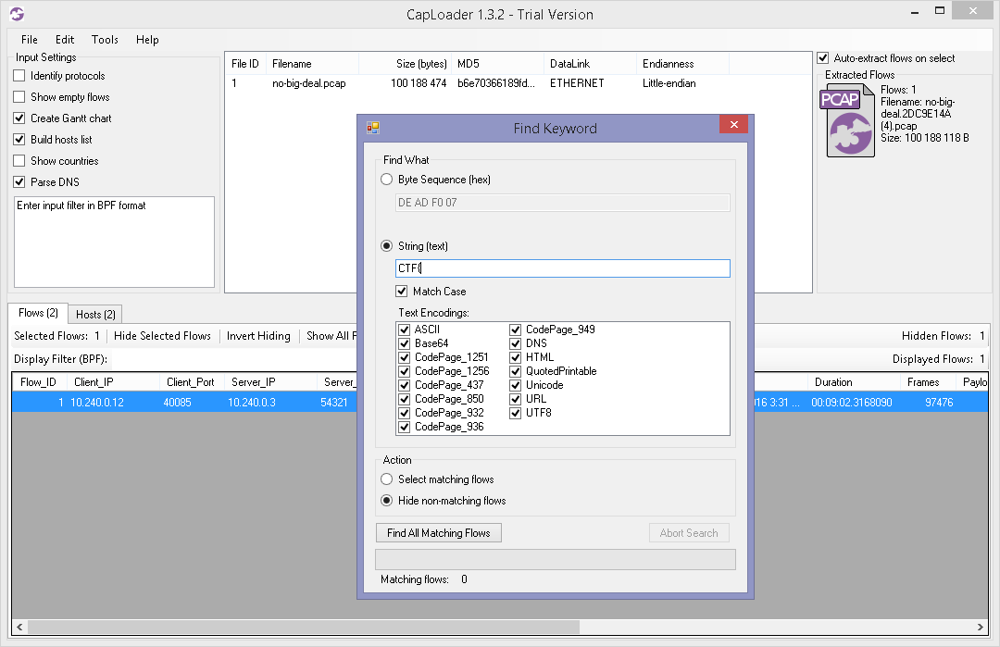

# Naive Search
We first searched for common encodings for the flag header "CTF{" with CapLoader:

Clearly, there was an encoded representation of the flag in the packet capture. Next we determined by elimination that it was Base64 being used, then we send the reassembled flow to a Base64 decoder to obtain the flag.
